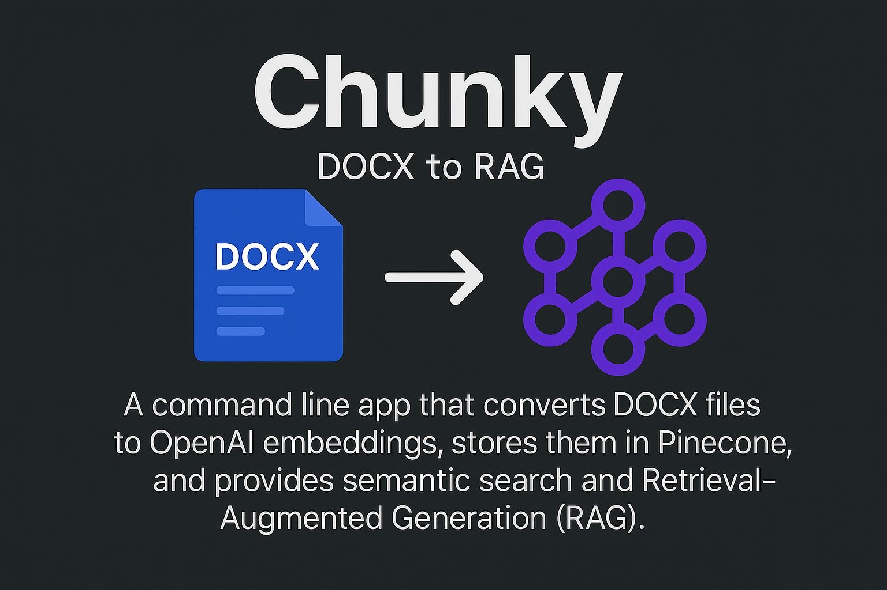

# Chunky

## From DOCX to RAG
A command-line Node.js app that converts DOCX files into OpenAI embeddings, stores them in Pinecone, and provides semantic (vector) search and Retrieval-Augmented Generation (RAG). Ask questions and get precise, context-aware GPT answers generated directly from your own content. This proof of concept features robust error handling with automatic retries, detailed state tracking, and batch processing for reliability and speed.

This will quickly evolve into a full and robust RAG service using AWS serverless technologies and capable of processing numerous file types sourced on-disk or in the cloud. Give me a minute.

### Prerequisites

- **Node.js** (v18+ recommended)
- **OpenAI API Key** (get one at [OpenAI](https://platform.openai.com/api-keys))
- **Pinecone API Key** (get one at [Pinecone](https://www.pinecone.io/))

### Configuration

Create a `.env` file in the root of your project ***before running any commands***, and add the following keys (use `/.env-sample` as a starting point):

```env
OPENAI_API_KEY=your-openai-api-key
PINECONE_API_KEY=your-pinecone-api-key
PINECONE_CLOUD=cloud-platform-like-aws-or-gcp
PINECONE_REGION=us-east-1-or-other
PINECONE_INDEX=arbitrary-name-of-your-index # the index should not already exist
```

### Directory Structure

```
project-root/
├── files/
│   ├── in/          # place DOCX files here
│   ├── out/         # embeddings generated here
│   └── processed/   # DOCX files moved here after processing
├── src/
│   ├── index.js            # ingestion entry point
│   ├── pinecone-create.js  # pinecone index creation entry point
│   ├── pinecone-delete.js  # pinecone embeddings deletion entry point
│   ├── pinecone-upload.js  # pinecone embeddings upload entry point
│   ├── pinecone-search.js  # pinecone vector search entry point
│   ├── local-search.js     # local embeddings search entry point
│   ├── rag.js
│   └── lib/
│       ├── parser.js
│       ├── chunker.js
│       ├── embedder.js
│       ├── storage.js
│       ├── ingester.js
│       ├── local-sdk.js
│       ├── pinecone-sdk.js
│       └── state-manager.js
├── .env
├── .env-sample      # a starter .env file
├── README.md
├── package.json
└── package-lock.json
```

## Quickstart
1. Install dependencies
```bash
npm install
```

2. Create your Pinecone index once:
```bash
npm run pc-create
```

3. Ingest all docx files and generate embeddings:
```bash
npm start
```

4. Upload embeddings to Pinecone:
```bash
npm run pc-upload
```

4. Ask GPT to answer in the context of your content:
```bash
npm run rag "your question here"
```


## App Command Reference

### Environment Setup

```bash
# install dependencies
npm install
```

### Pinecone Index Management

```bash
# create Pinecone index (run once)
npm run pc-create
# or
node src/pinecone-create.js

# delete all vectors from index
npm run pc-delete
# or
node src/pinecone-delete.js
```

### Create Embeddings Locally
```bash
# process all DOCX files
npm start
# or
npm run ingest
# or
node src/index.js

# process a single DOCX file
npm start book-slug
# or
npm run ingest book-slug
# or
node src/index.js book-slug 
```

The embeddings generated are stored in the `files/out` directory, organized by book slug (the book slug will be the filename minus the extension).

### Upload Embeddings to Pinecone

Uploads include automatic retries with exponential backoff to handle network interruptions.

```bash
# upload all embeddings to Pinecone
npm run pc-upload
# or
node src/pinecone-upload.js

# upload embeddings for a single book
npm run pc-upload book-slug
# or
node src/pinecone-upload.js book-slug
```

### Searching

You can perform semantic searches locally or via Pinecone:

```bash
# search embeddings stored locally
npm run local-search "your query"
# or
node src/local-search.js "your query"

# search embeddings in Pinecone index (vector search)
npm run pc-search "your query"
# or
node src/pinecone-search.js "your query"

# search a specific namespace in Pinecone
npm run pc-search "your query" namespace
# or
node src/pinecone-search.js "your query" namespace
```

### Retrieval-Augmented Generation (RAG)

Get context-aware GPT responses by leveraging Pinecone:

```bash
# GPT-augmented answer from Pinecone context
npm run rag "your question here"
# or
node src/rag.js "your question here"
```

This will query Pinecone, fetch relevant context, and return a GPT-generated response.

